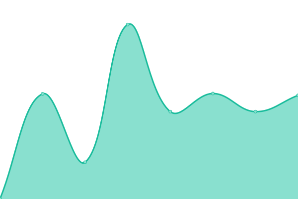

## 📈 Live Status: <!--live status--> **🟩 All systems operational**

<!--start: status pages-->
<!-- This summary is generated by Upptime (https://github.com/upptime/upptime) -->
<!-- Do not edit this manually, your changes will be overwritten -->

| URL                                                    | Status | History                                                                                                       | Response Time                                                                       | Uptime                                                                                                                                                                                                                                              |
| ------------------------------------------------------ | ------ | ------------------------------------------------------------------------------------------------------------- | ----------------------------------------------------------------------------------- | --------------------------------------------------------------------------------------------------------------------------------------------------------------------------------------------------------------------------------------------------- |
| [Documentation](https://documentation.platformos.com/) | 🟩 Up  | [documentation.yml](https://github.com/pavelloz/instances-uptimez/commits/master/history/documentation.yml)   |  603ms  |    |
| [Marketing page](https://www.platformos.com/)          | 🟩 Up  | [marketing-page.yml](https://github.com/pavelloz/instances-uptimez/commits/master/history/marketing-page.yml) |  635ms |  |
| [Examples](https://examples.platform-os.com/)          | 🟩 Up  | [examples.yml](https://github.com/pavelloz/instances-uptimez/commits/master/history/examples.yml)             |  500ms       |              |
| [Template MVP](https://getmarketplace.co)              | 🟩 Up  | [template-mvp.yml](https://github.com/pavelloz/instances-uptimez/commits/master/history/template-mvp.yml)     |  610ms   |       |

<!--end: status pages-->
