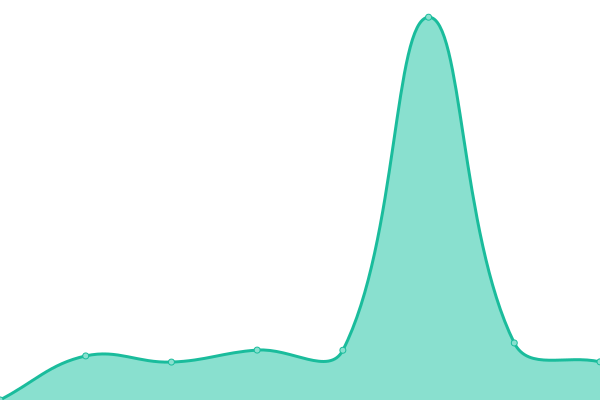

## 📈 Live Status: <!--live status--> **🟩 All systems operational**

<!--start: status pages-->
<!-- This summary is generated by Upptime (https://github.com/upptime/upptime) -->
<!-- Do not edit this manually, your changes will be overwritten -->
<!-- prettier-ignore -->
| URL | Status | History | Response Time | Uptime |
| --- | ------ | ------- | ------------- | ------ |
|  [Documentation](https://documentation.platformos.com) | 🟩 Up | [documentation.yml](https://github.com/mdyd-dev/status-instances/commits/HEAD/history/documentation.yml) | 

 674ms
     
 | 

<a href="https://status.platformos.com/history/documentation">100.00%</a>
    

|  [Marketing page](https://www.platformos.com) | 🟩 Up | [marketing-page.yml](https://github.com/mdyd-dev/status-instances/commits/HEAD/history/marketing-page.yml) | 

 3461ms
     
 | 

<a href="https://status.platformos.com/history/marketing-page">99.52%</a>
    

|  [Examples](https://examples.platform-os.com) | 🟩 Up | [examples.yml](https://github.com/mdyd-dev/status-instances/commits/HEAD/history/examples.yml) | 

 578ms
     
 | 

<a href="https://status.platformos.com/history/examples">99.55%</a>
    

|  [Community Site](https://community.platformos.com) | 🟩 Up | [community-site.yml](https://github.com/mdyd-dev/status-instances/commits/HEAD/history/community-site.yml) | 

 1733ms
     
 | 

<a href="https://status.platformos.com/history/community-site">100.00%</a>
    

|  [Partner Portal](https://partners.platformos.com) | 🟩 Up | [partner-portal.yml](https://github.com/mdyd-dev/status-instances/commits/HEAD/history/partner-portal.yml) | 

 474ms
     
 | 

<a href="https://status.platformos.com/history/partner-portal">100.00%</a>
    

|  [Sydney](https://prod01.sydney.platformos.com/_status) | 🟩 Up | [sydney.yml](https://github.com/mdyd-dev/status-instances/commits/HEAD/history/sydney.yml) | 

 1018ms
     
 | 

<a href="https://status.platformos.com/history/sydney">99.61%</a>
    

|  [Oregon](https://prod01.oregon.platform-os.com/_status) | 🟩 Up | [oregon.yml](https://github.com/mdyd-dev/status-instances/commits/HEAD/history/oregon.yml) | 

 320ms
     
 | 

<a href="https://status.platformos.com/history/oregon">99.69%</a>
    

|  [London](https://prod01.london.platform-os.com/_status) | 🟩 Up | [london.yml](https://github.com/mdyd-dev/status-instances/commits/HEAD/history/london.yml) | 

 627ms
     
 | 

<a href="https://status.platformos.com/history/london">99.83%</a>
    

|  [Oregon Staging](https://staging.oregon.platformos.com/_status) | 🟩 Up | [oregon-staging.yml](https://github.com/mdyd-dev/status-instances/commits/HEAD/history/oregon-staging.yml) | 

 346ms
     
 | 

<a href="https://status.platformos.com/history/oregon-staging">99.77%</a>
    

|  [HealthCheckUptimeGHA](https://hc-ping.com/3ee460af-46f0-46b6-b79c-0d3b0811be1e) | 🟩 Up | [health-check-uptime-gha.yml](https://github.com/mdyd-dev/status-instances/commits/HEAD/history/health-check-uptime-gha.yml) | 

 452ms
     
 | 

<a href="https://status.platformos.com/history/health-check-uptime-gha">100.00%</a>
    

<!--end: status pages-->
